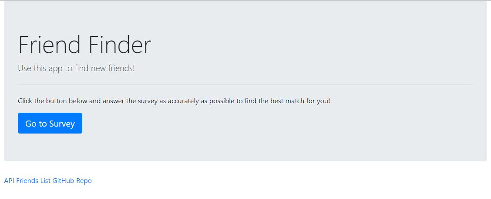

<h1>Friend Finder App</h1>

Friend Finder is an App where you answer a quick survey and, in a matter of seconds, are matched with a user who has previously submitted their answers.

Release 1.0 Minimum Viable Product (MVP):

* Home page:

* Survey:

The app is deployed to https://friends-finder-alr.herokuapp.com/.

<h2>Using the Friend Finder App</h2>

1. Go to https://friends-finder-alr.herokuapp.com/survey.

2. Fill out the form.

3. Click Submit to find your match.

<h2>MVP - How the App was developed</h2>

<h3>Release 1.0</h3>

**Phase One:** Set up the server.

**Phase Two:** Set up all the routes.

**Phase Three:** Create HTML files and create the friend matching logic.

**Phase Four:** Deploy the app to Heroku and test it.

<h2>Project Management</h2>

[Project Board](https://github.com/amandalragone/FriendFinder/projects/1)

<h2>Future Direction</h2>

- Send logic to the backend, store friends in a DB, validate form to ensure nothing has been skipped by the user.